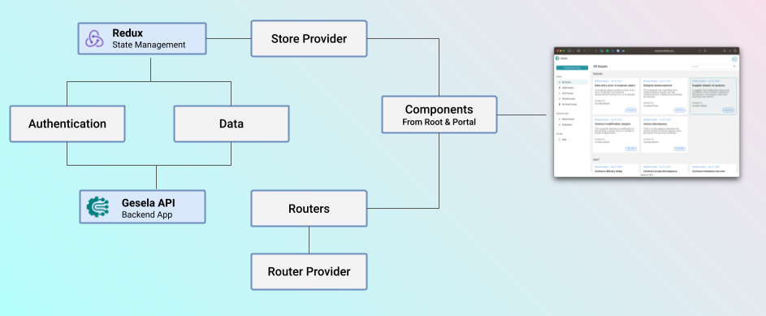
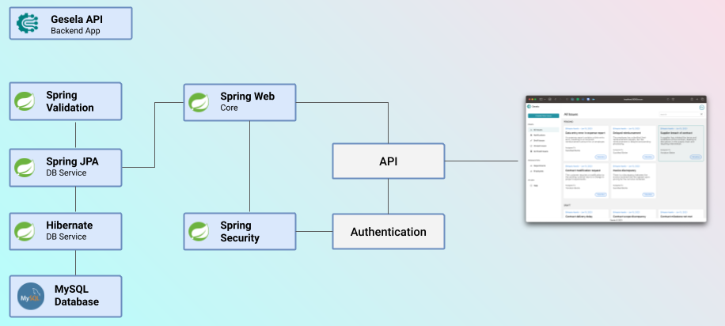

import ImageCaption from "../../../src/components/ImageCaption";
import GitHubProjectLink from "../../../src/components/GitHubProjectLink";

Gesela is an Enterprise Issue Tracking and Management system specifically designed for service-based organizations, with a focus on those in developing countries like Ethiopia.

## Background

Service-based companies are integral to any country, providing essential support to the community. Their services can range from simple to complex processes, but customer satisfaction is key to their success or failure.

Unfortunately, in developing countries, both government offices and some private companies use inefficient issue tracking and management systems resulting in customer frustration.

While international companies have implemented various methods to improve customer satisfaction, these approaches have not been widely adopted in our country.

## The Problem

The Problem that this software tries to address encompass the following

- Service based companies especially in Ethiopia are still not fully digitalized
- Black box model is still prevalent in most companies, where customers are not aware what is happening to their requests
- Manually following up issues is very hectic and time consuming
- Lack of transparency is a major contributor to low customer satisfaction
- Government offices (esp. In Ethiopian) are still serving customers using traditional methods
- Lack of real time feedback affects both the service organization and the customer

## Technologies Used

This project was built using ReactJS frontend and Spring Boot Backend. These tech stack is selected for various reasons including scalability and security

### Frontend

The frontend uses ReactJS with Redux. Redux is great library for sate management especially with the Redux Toolkit.
The over all architecture of the frontend web app looks like the below illustration

<ImageCaption>Gesela Frontend Architecture</ImageCaption>

As illustrated above, the react components communicate with the Redux Store for data as well as authentication.
Hence, the Redux store is the only source of truth for the frontend. The store in turn is connected to the backend Gesela API.
This makes the frontend very scalable and easy to maintain.

### Backend

The backend is built using Spring Boot. Spring Boot is a great framework for building REST APIs. It is very easy to use and has a lot of features out of the box.
The backend architecture looks like the below illustration

<ImageCaption>Gesela Backend Architecture</ImageCaption>

The backend utilizes a number of Spring Boot features including Spring Security, Spring Data JPA, Spring Web, etc to build a robust and secure REST API.
Furthermore, Hibernate is used as the ORM for the database. The database used is MySQL.

## Features

The following are the main features of the Gesela Issue Tracking and Management System:

- Allows both customers and employees to create, submit and track issues
- Allows the organization to manage issues effectively with a role based model (Issue Manager, and Issue Handler)
- Provides report to the organization to visualize the effectiveness of various departments
- Provides notifications in each step of the issues life cycle allowing for better transparency

## Demo

<iframe
  width="100%"
  height="415"
  src="https://www.youtube.com/embed/JVkEkr-wv7Q"
  title="YouTube video player"
  frameborder="0"
  allow="accelerometer; autoplay; clipboard-write; encrypted-media; gyroscope; picture-in-picture; web-share"
  allowfullscreen
></iframe>
<ImageCaption>Gesela Issue Tracking and Managment System</ImageCaption>

## Open Source

This project is open source and can be found on

<GitHubProjectLink
  url="https://github.com/kalibetre/gesela-issue-tracker"
  label="Gesela Issue Tracker Web App"
/>
<GitHubProjectLink
  url="https://github.com/kalibetre/gesela-api"
  label="Gesela API"
/>
